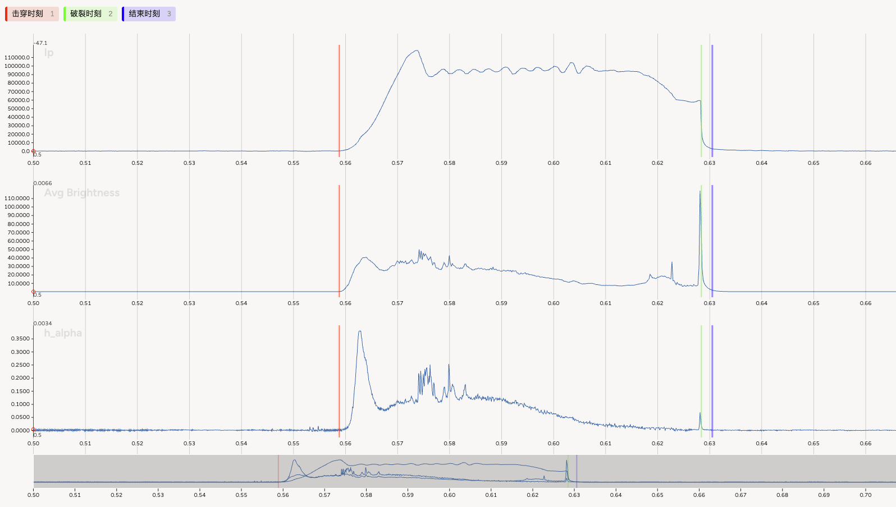
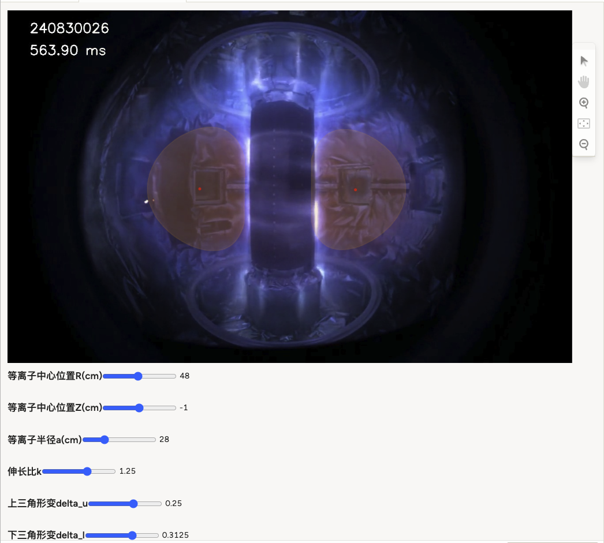

# TOKLABEL

> 这是 Label Studio 的基本工作流程以及 toklabel 使用方法的介绍

## 启动并连接 Label Studio

Label Studio使用helm管理版本，部署在k8s集群中。

使用nginx转发Label Studio的端口，直接访问 [http://<YOUR_LABEL_STUDIO_HOST>](http://<YOUR_LABEL_STUDIO_HOST>) 即可。

Label Studio 提供 API 端口，安装 label-studio-sdk 后，即可使用 python 连接客户端。

```bash
pip install label-studio-sdk
```

在 python 程序中连接 Label Studio 客户端需要你的 Access token，这在 Account & Settings 界面中能找到。

```python
import toklabel
# toklabel已经导入了label_studio_sdk,实际不需要额外手动导入，仅作展示
from label_studio_sdk import LabelStudio
API_KEY = '<YOUR_API_KEY>'  # 从 Label Studio 的 Account & Settings 获取
# 返回Label Studio客户端，使用Label Studio API的任何操作都需要该客户端
ls: LabelStudio = toklabel.connect_Label_Studio(API_key=API_KEY)
```

## 使用ProjectBuilder完成项目数据配置

现在，toklabel新增了ProjectBuilder已帮助完成项目数据配置，原来的配置方式并非删除，相关说明放在末尾。

使用ProjectBuilder完成项目配置十分简单，只需要完成配置文件，导入配置文件，并按流程调用函数就能完成项目配置。

### 配置文件

project-config.yaml是一个示例文件，您可以基于该文件进行修改，定义您自己的数据标注项目，甚至还可以实现数据通道间的计算、筛选符合需求的数据等需求。实例文件中的注释对各种变量的功能和规则已经有详细的介绍，在此不再赘述。此外，在projects文件夹中，你也可以找到一些实际项目的配置文件。

### 基本流程

导入配置文件并连接Label Studio客户端即可完成配置，如果在程序中需要调整部分参数也可以修改ProjectBuilder的属性或者

``` python
# 创建ProjectBuilder实例
pb = toklabel.ProjectBuilder('project-config.yaml')
# 导出数据，生成url，存入Redis数据库
urls = pb.prepare_data()
# 创建项目
proj = pb.create_project(ls)
# 向Label Studio创建并同步Redis存储
storage = pb.create_storage(ls)
print(storage)
```

## 导出标注并管理标注数据

创建项目，导入数据后就可以在 Label Studio 的页面进行标注。标注完成后，需要导出标注数据。

由于我们使用了 k8s 的 pgsql 数据库，实际上我们可以直接访问数据库以查询标注数据。但为了保证系统稳定，这里我通过官方 api 导出标注数据。

将 sdk 导出标注数据接口封装，可以实现导出记录了任务全部元数据的 json 或者仅记录和标注有关的数据的 json_min。详细介绍参照官方 api 文档：[https://api.labelstud.io/api-reference/api-reference/projects/exports/create](https://api.labelstud.io/api-reference/api-reference/projects/exports/create)

为了方便后续使用以及管理标注数据，可以使用toklabel处理标注数据并将标注数据存储到pgsql数据库中(与原始数据不在同一个数据库，config已包含相关配置信息)。通过将标注存储到pgsql，可以方便未来使用标注的特征提取所需的炮号
使用例见下

```python
# 读取数据，这里使用项目ip_feature为例
export_json = toklabel.export_annotation(ls, project_id, json_min=True, exclude_skipped=False, only_with_annotation=True)
with open('export.json','w') as f:
     json.dump(export_json,f)
# 处理json数据并存储
label_list = toklabel.simple_json_convertor(export_json, True, label_group_name='ip_time')
label_manager = toklabel.AnnotationManager() # 管理标注数据的类
label_manager.create_annotation_table('ip_feature', label_name='ip_time',unique_shot=True, point_allowed=False) #如果不存在表，创建标注表
label_manager.insert_annotations('ip_feature',label_list,on_conflict='shot') #插入数据  
```

## 删除本地储存

标注任务完成后，多余的csv文件和json文件可能并无太大价值，并且长此以往还会占据大量储存空间。因此，toklabel也支持删除存储对应路径下redis中的文件和导出的csv文件

```python
# 查看某个项目中的所有本地储存
storage_list = toklabel.search_storage(ls, project_id)
# toklabel支持删除存储路径中的所有文件以及记录
toklabel.delete_storage(ls, storage.id, keep_storage_link = False) 
```

## 不使用配置文件准备输入数据并配置项目

### 准备数据并创建新项目

#### 准备数据

Label Studio 只能将 csv 文件作为时间序列数据的原始数据文件，因此需要将 pgsql 数据库中的数据导出为 csv 文件。

为此，我们部署了一个服务器，可以将存储在PostgreSQL的诊断数据导出，并给出对应的URL，URL将被存储在redis数据库中。toklabel.utils中存在单独调用该服务器或者redis数据库的相关方法。
查询目标数据，至少需要提供炮号和信号通道，导出数据基于tokpy的接口完成，数据写了一个支持批量导出数据的函数(export_postgres_data)，用来批量导出多炮相同组成的放电数据，每一炮数据存储为 Panda.DataFrame 格式，如果有多组数据，则返回一个字典，其 key 为炮号，value 为 DataFrame 格式数据。
对于更个性化的需求，可以使用toklabel.utils中提供的函数帮助完成准备数据的流程。

#### 创建新项目

Label Studio 的时间序列数据标注项目需要根据 csv 的表头和标签内容自行配置标签界面。该网站 [https://labelstud.io/tags/](https://labelstud.io/tags/)详细介绍了各种标签配置。这里我根据上一步使用的 name_table_column 和 label_table 实现了基本标签配置功能。

为了方便使用，将 Label-Studio-sdk 的创建项目函数封装进 toklabel 中，可以单独接收 xml_config 或者 name_table_columns 与 label_table_columns 来创建项目。该链接（[https://api.labelstud.io/api-reference/api-reference/projects/create](https://api.labelstud.io/api-reference/api-reference/projects/create)）详细介绍了 sdk 提供的创建项目函数的更多输入参数以及返回结果。

使用示例

```python
import toklabel
name_table_columns_demo = {
        "ammeter": ("ammeter", ["CS1", "CS2", "PFP1"]),
        "flux_loop": ("flux_loop", [1, 2, 3, 8, 10])}
label_table = [("label1", ['effective']), ("label2",['stable','unstable','disruptive'])]
# 读取数据,返回结果是csv文件的url
data_urls = toklabel.prepare_data(project_name = 'demo_project',
                                        shots=[240830026, 240830027, 240830028, 240830029],
                                            name_table_columns=name_table_columns_demo,
                                            t_min=0,
                                            t_max=10,
                                            resolution=1e-3)
# 创建项目，请确保project_name和prepare_data()中的相同
proj = toklabel.create_project(ls, project_name="demo_project", 
                                description="demo_project", 
                                name_table_columns=name_table_columns_demo, 
                                label_table_columns=label_table)
```

### 同步储存并上传数据

#### (可选)生成预标注

json文件上传支持预标注，toklabel中定义了一个抽象类BasePredictor和标准输出数据类Prediction，只要实现抽象类就可以将预标注结果上传到Label Studio中

一个简单的示例如下

```python
class test_predictor(toklabel.BasePredictor):
    def __init__(self, label_name="effective"):
        self.label_name = label_name
    def predict(self, task_data: pd.DataFrame):
    # 需要实现的方法predict
        time = task_data['time']
        time_len = len(time)
        start = np.random.randint(0,int(time_len/2))
        end = start+50
        label_group = 'label1'
        label = self.label_name
    # 必须返回Prediction的列表，其中end可以为None，label_group与label应和项目配置相符    
        return [toklabel.Prediction(label_group, label, time[start], time[end])]
```

#### 同步储存，上传数据

Label Studio 支持直接读取原始数据文件(如 csv )或读取包含元数据的 json 文件(存储了原始数据文件的地址、预标注等)。 toklabel目前只支持json文件上传的模式，这与redis数据库更加契合，并且json上传功能更加丰富。

结合Label Studio官方提供的功能包 label-studio-sdk ，toklabel可以对本地Redis储存实现创建、验证、同步、删除等功能。也可以自行调用官方API以实现更精细的自定义功能，详细介绍参照官方 api 文档：[https://api.labelstud.io/api-reference/api-reference/import-storage/redis/create](https://api.labelstud.io/api-reference/api-reference/import-storage/redis/create)

同步Redis储存后，如果需要向该项目中加入新的数据，可以直接使用原有的Redis储存。Label Studio不会将完全相同的数据导入两遍。

toklabel使用示例

```python
# 可选，创建predictions
toklabel.import_prediction(project_name = 'demo_project', predictor = demo_predictor(), urls = data_urls)
# 创建并同步本地Redis储存
storage = toklabel.create_storage(ls, project_id = proj.id, project_name = 'demo_project')
```

## 使用示例
示例1：放电特征时间项目
包含几个功能：
1. 输入炮号自动生成数据并导入label studio，以下三个时序数据。
2. 模型自动预测三个特征时间（击穿、破裂、结束），给人工标注提供参考。
3. 自动根据人工标注的结果进行模型训练。



示例二：基于可见光的等离子体位形标注
根据等离子体位形参数进行最外闭合磁面的标注


